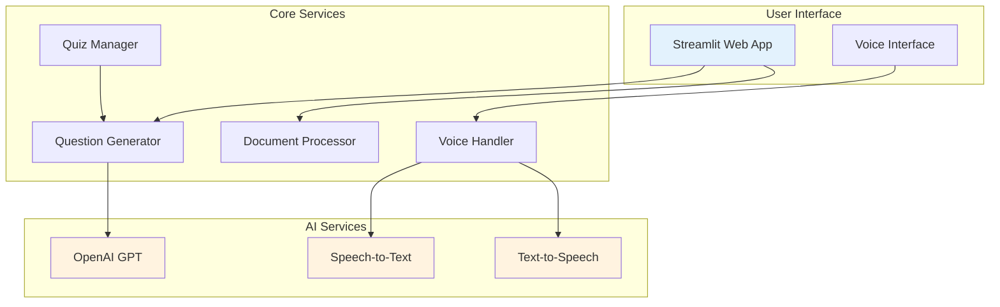
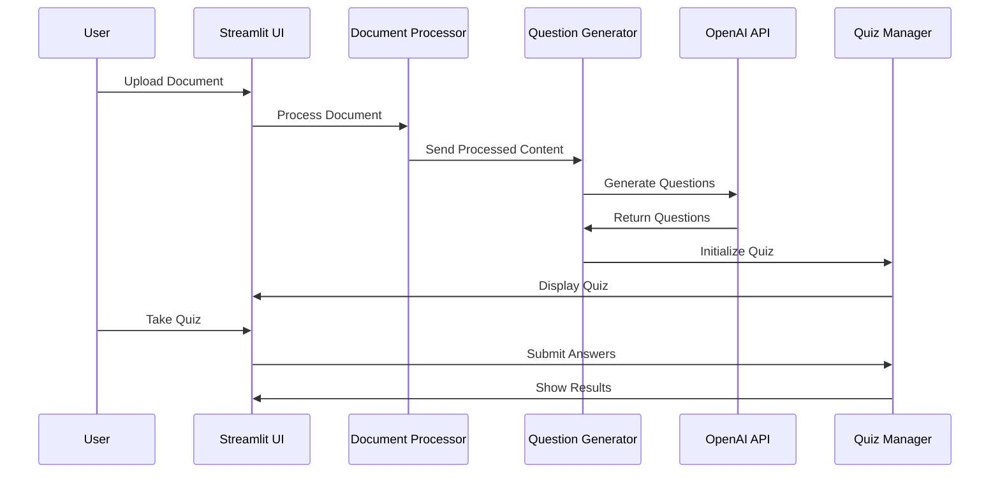

# 🎤 Voice-Based Quiz Generator

[](https://www.python.org/downloads/)
[](https://streamlit.io/)
[](https://openai.com/)
[](LICENSE)
[](https://github.com/reachbrt/voice-based-quiz-generator/stargazers)
[](https://github.com/reachbrt/voice-based-quiz-generator)

> **An AI-powered educational platform that transforms documents into interactive voice-based quizzes with adaptive difficulty and real-time performance analytics.**

## 📁 Project Structure

```
voice-based-quiz-generator/
├── 📄 Core Application
│   ├── app.py                    # Main Streamlit application
│   ├── config.py                 # Configuration management
│   ├── document_processor.py     # Document parsing (PDF, DOCX, TXT)
│   ├── question_generator.py     # AI-powered question generation
│   ├── quiz_manager.py          # Quiz session management
│   └── voice_handler.py         # Speech recognition & TTS
├── 📚 Documentation
│   ├── TECHNICAL_DOCUMENTATION.md  # Detailed technical guide
│   ├── ARCHITECTURE_DIAGRAMS.md    # System architecture diagrams
│   ├── SYSTEM_OVERVIEW.md          # High-level project overview
│   ├── CONTRIBUTING.md             # Contribution guidelines
│   ├── INSTALL.md                  # Installation instructions
│   └── SETUP_INSTRUCTIONS.md       # Setup guide
├── 🧪 Tests
│   ├── test_installation.py        # Installation verification
│   ├── test_session_state.py       # Session state testing
│   ├── test_openai_fix.py          # OpenAI integration tests
│   ├── test_json_parsing.py        # JSON parsing tests
│   ├── verify_setup.py             # Setup verification
│   └── quick_test.py               # Quick functionality test
├── 📜 Scripts
│   ├── setup.py                    # Project setup script
│   ├── deploy_and_run.sh          # Deployment automation
│   ├── github_setup.sh            # GitHub repository setup
│   └── create_github_repo.sh      # Repository creation
├── 💡 Examples
│   └── demo.py                     # Demo application
├── 🎨 Assets
│   └── (images, audio files, etc.)
├── ⚙️ Configuration
│   ├── requirements.txt            # Python dependencies
│   ├── .env.example               # Environment variables template
│   ├── Makefile                   # Build automation
│   └── LICENSE                    # MIT License
└── 📖 Documentation
    └── README.md                   # This file
```

## 🌟 Overview

The Voice-Based Quiz Generator is a sophisticated educational technology platform that leverages cutting-edge AI to create personalized learning experiences. Upload any document, and watch as advanced language models transform your content into engaging, voice-interactive quizzes that adapt to your learning pace.

### 🎯 Key Highlights
- **🤖 AI-Powered**: OpenAI GPT-3.5/4 for intelligent question generation
- **🎤 Voice-First**: Complete hands-free quiz experience
- **📄 Multi-Format**: PDF, DOCX, TXT document processing
- **📊 Analytics**: Comprehensive performance tracking and insights
- **🎯 Adaptive**: Dynamic difficulty adjustment based on performance
- **🌐 Web-Based**: Modern Streamlit interface, no installation required

## 🏗️ System Architecture



## ✨ Features

### 📄 **Intelligent Document Processing**
- **Multi-Format Support**: Seamlessly process PDF, DOCX, and TXT files
- **Smart Text Extraction**: Advanced parsing with content cleaning and optimization
- **Content Preview**: Review and validate extracted content before quiz generation
- **Large Document Handling**: Automatic chunking for optimal processing

### 🤖 **AI-Powered Question Generation**
- **GPT Integration**: Leverages OpenAI's most advanced language models
- **Contextual Questions**: Generates relevant questions based on document content
- **Multiple Difficulty Levels**: Easy, Medium, and Hard question variants
- **Topic Focusing**: Target specific subjects within your content
- **Quality Validation**: Automatic question validation and formatting

### 🎤 **Advanced Voice Interaction**
- **Natural Speech Recognition**: High-accuracy voice-to-text conversion
- **Expressive Text-to-Speech**: Natural-sounding question delivery and feedback
- **Multi-Language Support**: Configurable language settings
- **Voice Command Processing**: Intelligent parsing of spoken answers (A, B, C, D)
- **Audio Feedback**: Immediate spoken explanations and encouragement

### 📊 **Comprehensive Analytics**
- **Real-Time Progress**: Live tracking of quiz completion and performance
- **Detailed Metrics**: Accuracy, response time, and difficulty progression
- **Performance Trends**: Historical analysis and improvement tracking
- **Topic Analysis**: Subject-specific performance insights
- **Export Capabilities**: Download detailed results in multiple formats

### 🎯 **Adaptive Learning System**
- **Dynamic Difficulty**: Automatic adjustment based on performance patterns
- **Personalized Pacing**: Adapts to individual learning speeds
- **Performance Optimization**: Identifies strengths and areas for improvement
- **Learning Path Recommendations**: Suggests focus areas based on analytics

## 🚀 Quick Start

### Prerequisites
- Python 3.8 or higher
- OpenAI API key ([Get one here](https://platform.openai.com/api-keys))
- Microphone access for voice features

### Installation

```bash
# 1. Clone the repository
git clone https://github.com/reachbrt/voice-based-quiz-generator.git
cd voice-based-quiz-generator

# 2. Create virtual environment (recommended)
python -m venv venv
source venv/bin/activate  # On Windows: venv\Scripts\activate

# 3. Install dependencies
pip install -r requirements.txt

# 4. Configure environment
cp .env.example .env
# Edit .env and add your OpenAI API key

# 5. Run the application
streamlit run app.py
```

### Alternative Setup Methods

#### Using Make (macOS/Linux)
```bash
make quickstart  # Complete setup with virtual environment
make run         # Start the application
```

#### Using Setup Script
```bash
# Automated setup
python scripts/setup.py

# Run tests to verify installation
python tests/test_installation.py
```

#### Using Docker
```bash
docker build -t quiz-generator .
docker run -p 8501:8501 quiz-generator
```

## 📖 Usage Guide

### 🎯 **Creating Your First Quiz**

1. **Launch Application**: Open http://localhost:8501 in your browser
2. **Upload Content**: 
   - Upload a document (PDF, DOCX, TXT) OR
   - Enter a topic manually (e.g., "Machine Learning Basics")
3. **Configure Settings**: Set difficulty, number of questions, and voice preferences
4. **Generate Quiz**: Click "Generate Quiz Questions" and wait for AI processing
5. **Take Quiz**: Answer questions using voice or text input
6. **Review Results**: Analyze performance and export results

### 🎤 **Voice Mode Features**

- **Question Delivery**: Questions are read aloud automatically
- **Voice Answers**: Say "A", "B", "C", or "D" to answer
- **Alternative Commands**: Use "Alpha", "Bravo", "Charlie", "Delta"
- **Audio Feedback**: Receive spoken explanations for each answer
- **Hands-Free Operation**: Complete quizzes without touching the interface

### 📊 **Analytics Dashboard**

- **Real-Time Metrics**: Track accuracy and progress during quizzes
- **Performance History**: View improvement trends over time
- **Topic Analysis**: Identify strengths and weaknesses by subject
- **Detailed Reports**: Export comprehensive performance data
- **Adaptive Insights**: See how difficulty adjusts to your learning

## 🔧 Technical Documentation

### 📚 **Comprehensive Guides**
- **[Technical Documentation](docs/TECHNICAL_DOCUMENTATION.md)**: Detailed system architecture and component analysis
- **[Architecture Diagrams](docs/ARCHITECTURE_DIAGRAMS.md)**: Visual system design and data flow diagrams
- **[System Overview](docs/SYSTEM_OVERVIEW.md)**: High-level project overview and workflows
- **[Installation Guide](docs/INSTALL.md)**: Step-by-step setup instructions
- **[Contributing Guide](docs/CONTRIBUTING.md)**: How to contribute to the project
- **[Setup Instructions](docs/SETUP_INSTRUCTIONS.md)**: Detailed setup guide

### 🏛️ **System Components**

| Component | Purpose | Technology |
|-----------|---------|------------|
| **App Manager** | Main orchestrator and UI controller | Streamlit |
| **Document Processor** | Multi-format document parsing | PyPDF2, python-docx |
| **Question Generator** | AI-powered question creation | OpenAI GPT-3.5/4 |
| **Voice Handler** | Speech recognition and synthesis | Google Speech API, gTTS |
| **Quiz Manager** | Session management and analytics | Python, pandas |
| **Performance Analyzer** | Learning analytics and insights | plotly, numpy |

### 🔄 **Data Flow Overview**



## 🛠️ Configuration

### Environment Variables

| Variable | Description | Default | Required |
|----------|-------------|---------|----------|
| `OPENAI_API_KEY` | OpenAI API key for question generation | - | ✅ |
| `OPENAI_MODEL` | GPT model to use | gpt-3.5-turbo | ❌ |
| `DEFAULT_QUESTIONS_PER_QUIZ` | Default number of questions | 10 | ❌ |
| `TTS_LANGUAGE` | Text-to-speech language | en | ❌ |
| `SPEECH_RECOGNITION_LANGUAGE` | Speech recognition language | en-US | ❌ |

### Advanced Configuration

```python
# config.py - Customize these settings
DIFFICULTY_LEVELS = ['easy', 'medium', 'hard']
PERFORMANCE_THRESHOLD = 0.7  # Adaptive difficulty trigger
MAX_FILE_SIZE_MB = 10        # Upload limit
ALLOWED_EXTENSIONS = ['pdf', 'docx', 'txt']
```

## 🔍 Troubleshooting

### Common Issues & Solutions

#### 🔧 **Installation Issues**
```bash
# PyAudio installation (macOS)
brew install portaudio
pip install pyaudio

# PyAudio installation (Ubuntu/Debian)
sudo apt-get install portaudio19-dev
pip install pyaudio

# PyAudio installation (Windows)
pip install pipwin
pipwin install pyaudio
```

#### 🤖 **OpenAI API Issues**
- **Invalid API Key**: Verify key at https://platform.openai.com/api-keys
- **Rate Limiting**: Check usage limits and billing
- **Model Access**: Ensure access to GPT-3.5-turbo or GPT-4

#### 🎤 **Voice Recognition Issues**
- **Microphone Permissions**: Allow browser microphone access
- **Audio Quality**: Use a good microphone in quiet environment
- **Browser Compatibility**: Chrome and Firefox work best
- **Network Issues**: Stable internet required for speech services

#### 📄 **Document Processing Issues**
- **File Format**: Ensure PDF, DOCX, or TXT format
- **File Size**: Keep files under 10MB
- **File Corruption**: Try with a different file
- **Encoding Issues**: For TXT files, use UTF-8 encoding

### Performance Optimization

- **Large Documents**: Split into smaller sections for better processing
- **API Costs**: Monitor OpenAI usage and optimize prompts
- **Memory Usage**: Close unused browser tabs during intensive processing
- **Network**: Use stable, high-speed internet connection

## 🤝 Contributing

We welcome contributions! Here's how you can help:

### 🎯 **Ways to Contribute**
- **🐛 Bug Reports**: Report issues with detailed reproduction steps
- **✨ Feature Requests**: Suggest new features or improvements
- **📝 Documentation**: Improve guides, tutorials, and examples
- **💻 Code Contributions**: Submit pull requests for fixes or features
- **🧪 Testing**: Help test new features and report feedback

### 🔄 **Development Workflow**
1. Fork the repository
2. Create a feature branch (`git checkout -b feature/amazing-feature`)
3. Make your changes
4. Add tests for new functionality
5. Commit your changes (`git commit -m 'Add amazing feature'`)
6. Push to the branch (`git push origin feature/amazing-feature`)
7. Open a Pull Request

### 📋 **Development Setup**
```bash
# Clone your fork
git clone https://github.com/yourusername/voice-based-quiz-generator.git
cd voice-based-quiz-generator

# Install development dependencies
make dev-install

# Run tests
make test

# Format code
make format

# Lint code
make lint
```

## 🧪 Testing

### Running Tests
```bash
# Run all tests
python -m pytest tests/

# Run specific test categories
python tests/test_installation.py      # Installation verification
python tests/test_session_state.py     # Session state testing
python tests/test_openai_fix.py        # OpenAI integration
python tests/verify_setup.py           # Setup verification

# Quick functionality test
python tests/quick_test.py
```

### Test Categories
- **Installation Tests**: Verify dependencies and setup
- **Unit Tests**: Individual component testing
- **Integration Tests**: Component interaction testing
- **Session State Tests**: Streamlit session management
- **API Tests**: External service integration
- **Performance Tests**: Load and stress testing

### Adding New Tests
1. Create test files in the `tests/` directory
2. Follow naming convention: `test_*.py`
3. Use descriptive test function names
4. Include both positive and negative test cases
5. Add documentation for complex test scenarios

## 📄 License

This project is licensed under the MIT License - see the [LICENSE](LICENSE) file for details.

## 🙏 Acknowledgments

- **OpenAI** for providing advanced language models
- **Streamlit** for the excellent web framework
- **Google** for speech recognition and text-to-speech services
- **Contributors** who help improve this project

## 📞 Support

### 🆘 **Getting Help**
- **📖 Documentation**: Check our comprehensive guides
- **🐛 Issues**: Search existing issues or create a new one
- **💬 Discussions**: Join community discussions on GitHub
- **📧 Contact**: Reach out for enterprise or custom solutions

### 🔗 **Useful Links**
- **[Live Demo](http://localhost:8501)**: Try the application locally
- **[GitHub Repository](https://github.com/reachbrt/voice-based-quiz-generator)**: Source code and issues
- **[Technical Docs](docs/TECHNICAL_DOCUMENTATION.md)**: Detailed technical information
- **[Project Structure](docs/PROJECT_STRUCTURE.md)**: Detailed project organization
- **[API Documentation](https://platform.openai.com/docs)**: OpenAI API reference

## 📁 Project Organization

This project follows a clean, organized structure for maintainability and ease of contribution:

- **📄 Core Application**: Main Python modules in root directory
- **📚 Documentation**: Comprehensive guides in `docs/` folder
- **🧪 Tests**: All test files organized in `tests/` folder
- **📜 Scripts**: Automation scripts in `scripts/` folder
- **💡 Examples**: Demo and example files in `examples/` folder
- **🎨 Assets**: Sample documents and media in `assets/` folder

For detailed information about the project structure, see [docs/PROJECT_STRUCTURE.md](docs/PROJECT_STRUCTURE.md).

---

<div align="center">

**⭐ Star this repository if you find it helpful!**

Made with ❤️ by [reachbrt](https://github.com/reachbrt)

</div>
