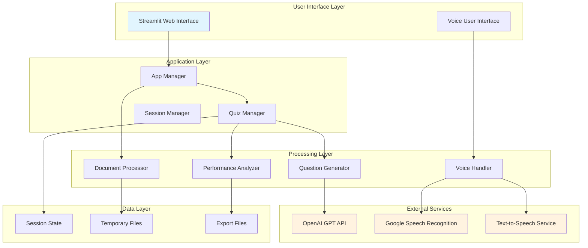
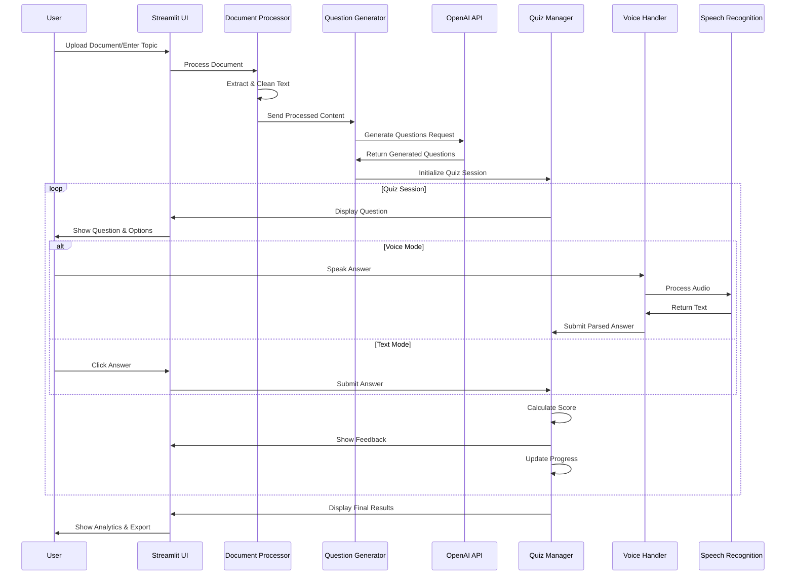

# 🎤 Voice-Based Quiz Generator - Technical Documentation

## 📋 Table of Contents
1. [System Overview](#system-overview)
2. [Architecture Diagram](#architecture-diagram)
3. [Component Details](#component-details)
4. [Data Flow](#data-flow)
5. [API Integration](#api-integration)
6. [Database Schema](#database-schema)
7. [Security Considerations](#security-considerations)
8. [Performance Optimization](#performance-optimization)
9. [Deployment Guide](#deployment-guide)
10. [Troubleshooting](#troubleshooting)

## 🏗️ System Overview

The Voice-Based Quiz Generator is an AI-powered educational platform that creates interactive quizzes from documents and conducts voice-based assessments. The system leverages modern AI technologies including OpenAI GPT for question generation, speech recognition for voice input, and text-to-speech for audio feedback.

### 🎯 Core Objectives
- **Automated Content Processing**: Extract and process educational content from various document formats
- **AI-Powered Question Generation**: Create contextually relevant quiz questions using advanced language models
- **Voice Interaction**: Provide hands-free quiz experience with speech recognition and synthesis
- **Adaptive Learning**: Adjust difficulty based on user performance
- **Performance Analytics**: Track learning progress and provide detailed insights

### 🛠️ Technology Stack

| Component | Technology | Purpose |
|-----------|------------|---------|
| **Frontend** | Streamlit | Web-based user interface |
| **AI Engine** | OpenAI GPT-3.5/4 | Question generation and content analysis |
| **Voice Processing** | Google Speech Recognition + gTTS | Speech-to-text and text-to-speech |
| **Document Processing** | PyPDF2, python-docx | Multi-format document parsing |
| **Audio Processing** | PyAudio, pydub | Audio input/output handling |
| **Data Visualization** | Plotly | Performance analytics and charts |
| **Configuration** | python-dotenv | Environment management |
| **Session Management** | Streamlit Session State | User session persistence |

## 🏛️ Architecture Diagram



## 🔧 Component Details

### 1. **App Manager (`app.py`)**
**Purpose**: Main application orchestrator and UI controller

**Key Responsibilities**:
- Initialize all system components
- Manage user interface routing
- Handle user interactions and form submissions
- Coordinate between different modules
- Manage application state and navigation

**Key Functions**:
```python
def main()                          # Main application entry point
def initialize_components()         # Initialize all system components
def display_setup_interface()       # Show document upload and topic input
def display_quiz_interface()        # Show active quiz interface
def display_question()              # Render current question
def process_answer()                # Handle user answer submission
def display_quiz_results()          # Show final results and analytics
```

### 2. **Document Processor (`document_processor.py`)**
**Purpose**: Extract and preprocess content from various document formats

**Supported Formats**:
- **PDF**: Using PyPDF2 for text extraction
- **DOCX**: Using python-docx for Word document processing
- **TXT**: Direct text file reading with encoding detection

**Key Functions**:
```python
def extract_text_from_file()        # Main extraction method
def _extract_from_pdf()             # PDF-specific extraction
def _extract_from_docx()            # Word document extraction
def _extract_from_txt()             # Text file extraction
def preprocess_text()               # Clean and normalize text
def chunk_text()                    # Split large documents into chunks
```

**Processing Pipeline**:
1. **File Upload** → Temporary file creation
2. **Format Detection** → Based on file extension
3. **Text Extraction** → Format-specific extraction
4. **Text Cleaning** → Remove formatting, normalize whitespace
5. **Content Chunking** → Split into manageable segments

### 3. **Question Generator (`question_generator.py`)**
**Purpose**: Generate contextually relevant quiz questions using AI

**AI Integration**:
- **Model**: OpenAI GPT-3.5-turbo/GPT-4
- **Prompt Engineering**: Structured prompts for consistent output
- **Response Parsing**: Robust JSON extraction and validation
- **Fallback System**: Sample questions when AI is unavailable

**Key Functions**:
```python
def generate_questions()            # Main question generation
def _create_prompt()                # Build AI prompt
def _parse_questions()              # Parse AI response
def _validate_question()            # Validate question structure
def generate_adaptive_questions()   # Difficulty-adaptive generation
def _generate_sample_questions()    # Fallback sample questions
```

**Question Structure**:
```json
{
  "question": "Question text",
  "options": {
    "A": "Option A text",
    "B": "Option B text",
    "C": "Option C text",
    "D": "Option D text"
  },
  "correct_answer": "B",
  "explanation": "Detailed explanation",
  "difficulty": "medium",
  "topic": "Subject area"
}
```

### 4. **Voice Handler (`voice_handler.py`)**
**Purpose**: Manage speech recognition and text-to-speech functionality

**Voice Technologies**:
- **Speech Recognition**: Google Speech Recognition API
- **Text-to-Speech**: Google Text-to-Speech (gTTS)
- **Audio Processing**: PyAudio for microphone input
- **Audio Playback**: HTML5 audio player integration

**Key Functions**:
```python
def text_to_speech()                # Convert text to audio
def speech_to_text()                # Convert audio to text
def create_question_audio()         # Generate question audio
def create_feedback_audio()         # Generate feedback audio
def parse_voice_answer()            # Parse spoken answers
def get_audio_html()                # Create HTML audio player
```

**Voice Recognition Pipeline**:
1. **Audio Capture** → Microphone input via PyAudio
2. **Audio Processing** → Format conversion and noise reduction
3. **Speech Recognition** → Google Speech API processing
4. **Answer Parsing** → Extract A/B/C/D responses
5. **Validation** → Confirm recognized answer

### 5. **Quiz Manager (`quiz_manager.py`)**
**Purpose**: Orchestrate quiz sessions and track performance

**Session Management**:
- **State Persistence**: Streamlit session state integration
- **Progress Tracking**: Real-time quiz progress monitoring
- **Performance Analytics**: Detailed scoring and timing analysis
- **Adaptive Difficulty**: Dynamic difficulty adjustment

**Key Functions**:
```python
def start_quiz()                    # Initialize new quiz session
def get_current_question()          # Retrieve current question
def submit_answer()                 # Process answer submission
def get_quiz_progress()             # Calculate progress metrics
def get_session_stats()             # Generate performance statistics
def export_session_data()           # Export results to JSON
```

**Performance Metrics**:
- **Accuracy**: Percentage of correct answers
- **Response Time**: Average time per question
- **Difficulty Progression**: Adaptive difficulty tracking
- **Topic Performance**: Subject-specific analytics
- **Learning Curve**: Progress over time

### 6. **Configuration Manager (`config.py`)**
**Purpose**: Centralized configuration and environment management

**Configuration Categories**:
- **API Keys**: OpenAI, Google Services
- **Model Settings**: GPT model, temperature, tokens
- **Voice Settings**: Language, timeout values
- **Quiz Parameters**: Default questions, difficulty levels
- **File Handling**: Upload limits, supported formats

## 🔄 Data Flow Diagram



## 🔌 API Integration Details

### OpenAI GPT Integration
**Endpoint**: `https://api.openai.com/v1/chat/completions`
**Authentication**: Bearer token (API key)
**Model**: gpt-3.5-turbo or gpt-4

**Request Structure**:
```json
{
  "model": "gpt-3.5-turbo",
  "messages": [
    {
      "role": "system",
      "content": "You are an expert quiz generator..."
    },
    {
      "role": "user",
      "content": "Generate questions from: [content]"
    }
  ],
  "max_tokens": 1000,
  "temperature": 0.7
}
```

**Response Handling**:
- **Success**: Parse JSON questions from response
- **Rate Limiting**: Implement exponential backoff
- **Error Handling**: Fallback to sample questions
- **Cost Optimization**: Token usage monitoring

### Google Speech Recognition
**Service**: Google Cloud Speech-to-Text API
**Audio Format**: WAV, 16kHz, mono
**Language**: Configurable (default: en-US)

**Processing Pipeline**:
1. **Audio Capture** → PyAudio microphone input
2. **Format Conversion** → Convert to required format
3. **API Request** → Send audio to Google API
4. **Response Processing** → Extract text from response
5. **Answer Parsing** → Identify A/B/C/D responses

## 📊 Database Schema

### Session State Structure
```python
quiz_session = {
    'questions': List[Dict],        # Generated questions
    'current_question': int,        # Current question index
    'answers': List[Dict],          # User answers with metadata
    'scores': List[float],          # Question scores
    'start_time': datetime,         # Session start time
    'end_time': datetime,           # Session end time
    'difficulty': str,              # Current difficulty level
    'performance_history': List[float],  # Historical performance
    'session_active': bool          # Session status
}
```

### Answer Record Structure
```python
answer_record = {
    'question_index': int,          # Question position
    'user_answer': str,             # User's selected answer
    'correct_answer': str,          # Correct answer
    'is_correct': bool,             # Answer correctness
    'time_taken': float,            # Response time in seconds
    'score': float,                 # Calculated score (0-1)
    'timestamp': datetime,          # Answer submission time
    'difficulty': str,              # Question difficulty
    'topic': str                    # Question topic
}
```

## 🔒 Security Considerations

### API Key Management
- **Environment Variables**: Store sensitive keys in `.env` files
- **Key Rotation**: Regular API key rotation policy
- **Access Control**: Limit API key permissions
- **Monitoring**: Track API usage and costs

### Data Privacy
- **Temporary Storage**: Documents processed in memory only
- **Session Isolation**: User sessions are isolated
- **No Persistent Storage**: No user data stored permanently
- **GDPR Compliance**: Data processing transparency

### Input Validation
- **File Type Validation**: Restrict to supported formats
- **File Size Limits**: Prevent resource exhaustion
- **Content Sanitization**: Clean extracted text
- **SQL Injection Prevention**: Parameterized queries (if database used)

## ⚡ Performance Optimization

### Caching Strategies
```python
@st.cache_resource
def initialize_components():
    """Cache component initialization"""
    return doc_processor, question_generator, voice_handler

@st.cache_data
def process_document(file_content):
    """Cache document processing results"""
    return processed_text
```

### Memory Management
- **Temporary File Cleanup**: Automatic cleanup of audio/document files
- **Session State Optimization**: Efficient state management
- **Lazy Loading**: Load components only when needed
- **Resource Pooling**: Reuse expensive objects

### API Optimization
- **Request Batching**: Combine multiple questions in single API call
- **Response Caching**: Cache generated questions for reuse
- **Token Optimization**: Minimize token usage in prompts
- **Rate Limiting**: Respect API rate limits

## 🚀 Deployment Guide

### Local Development Setup
```bash
# 1. Clone repository
git clone https://github.com/reachbrt/voice-based-quiz-generator.git
cd voice-based-quiz-generator

# 2. Create virtual environment
python -m venv venv
source venv/bin/activate  # Linux/Mac
# or venv\Scripts\activate  # Windows

# 3. Install dependencies
pip install -r requirements.txt

# 4. Configure environment
cp .env.example .env
# Edit .env with your API keys

# 5. Run application
streamlit run app.py
```

### Production Deployment

#### Docker Deployment
```dockerfile
FROM python:3.9-slim

WORKDIR /app
COPY requirements.txt .
RUN pip install -r requirements.txt

COPY . .
EXPOSE 8501

CMD ["streamlit", "run", "app.py", "--server.port=8501", "--server.address=0.0.0.0"]
```

#### Cloud Deployment Options
1. **Streamlit Cloud**: Direct GitHub integration
2. **Heroku**: Container-based deployment
3. **AWS ECS**: Scalable container deployment
4. **Google Cloud Run**: Serverless container platform

### Environment Variables
```bash
# Required
OPENAI_API_KEY=your_openai_api_key

# Optional
OPENAI_MODEL=gpt-3.5-turbo
OPENAI_MAX_TOKENS=1000
OPENAI_TEMPERATURE=0.7
TTS_LANGUAGE=en
SPEECH_RECOGNITION_LANGUAGE=en-US
```

## 🔧 Troubleshooting

### Common Issues

#### 1. OpenAI API Errors
**Problem**: "You tried to access openai.ChatCompletion..."
**Solution**:
```bash
pip install openai>=1.0.0
# Update code to use new API format
```

#### 2. PyAudio Installation Issues
**Problem**: "Could not find PyAudio"
**Solution**:
```bash
# macOS
brew install portaudio
pip install pyaudio

# Ubuntu/Debian
sudo apt-get install portaudio19-dev
pip install pyaudio

# Windows
pip install pipwin
pipwin install pyaudio
```

#### 3. Speech Recognition Errors
**Problem**: "Could not understand audio"
**Solutions**:
- Check microphone permissions
- Ensure stable internet connection
- Speak clearly and avoid background noise
- Try different browsers (Chrome recommended)

#### 4. Document Processing Failures
**Problem**: "Error processing file"
**Solutions**:
- Verify file format (PDF, DOCX, TXT only)
- Check file size limits (< 10MB)
- Ensure file is not corrupted
- Try different file encoding for text files

### Performance Issues

#### Slow Question Generation
**Causes**:
- Large document size
- High API latency
- Complex content

**Solutions**:
- Chunk large documents
- Optimize prompts
- Use faster GPT models
- Implement caching

#### Memory Usage
**Monitoring**:
```python
import psutil
import streamlit as st

def monitor_memory():
    memory = psutil.virtual_memory()
    st.sidebar.metric("Memory Usage", f"{memory.percent}%")
```

### Debugging Tools

#### Enable Debug Mode
```python
# In config.py
DEBUG_MODE = True

# In app.py
if Config.DEBUG_MODE:
    st.write("Debug Info:", debug_data)
```

#### Logging Configuration
```python
import logging

logging.basicConfig(
    level=logging.INFO,
    format='%(asctime)s - %(name)s - %(levelname)s - %(message)s',
    handlers=[
        logging.FileHandler('quiz_app.log'),
        logging.StreamHandler()
    ]
)
```

## 📈 Monitoring and Analytics

### Application Metrics
- **User Sessions**: Active session count
- **Question Generation**: Success/failure rates
- **Voice Recognition**: Accuracy metrics
- **Performance**: Response times
- **Errors**: Error rates and types

### Business Metrics
- **User Engagement**: Session duration
- **Learning Effectiveness**: Score improvements
- **Content Usage**: Popular topics
- **Feature Adoption**: Voice vs text usage

---

## 🎯 Summary

The Voice-Based Quiz Generator is a sophisticated educational platform that combines modern AI technologies with intuitive user interfaces. The modular architecture ensures scalability, maintainability, and extensibility while providing a seamless user experience.

**Key Technical Achievements**:
- ✅ **Modular Architecture**: Clean separation of concerns
- ✅ **AI Integration**: Advanced language model utilization
- ✅ **Voice Processing**: Real-time speech recognition and synthesis
- ✅ **Adaptive Learning**: Performance-based difficulty adjustment
- ✅ **Robust Error Handling**: Graceful degradation and fallbacks
- ✅ **Comprehensive Testing**: Unit tests and integration tests
- ✅ **Production Ready**: Deployment guides and monitoring

This documentation provides the foundation for understanding, extending, and maintaining the Voice-Based Quiz Generator system.
```
