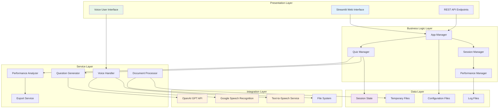
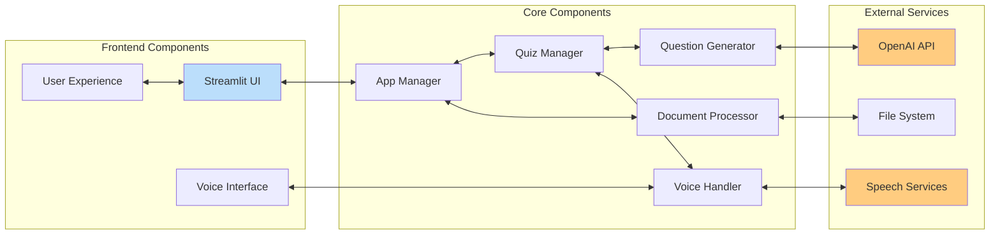
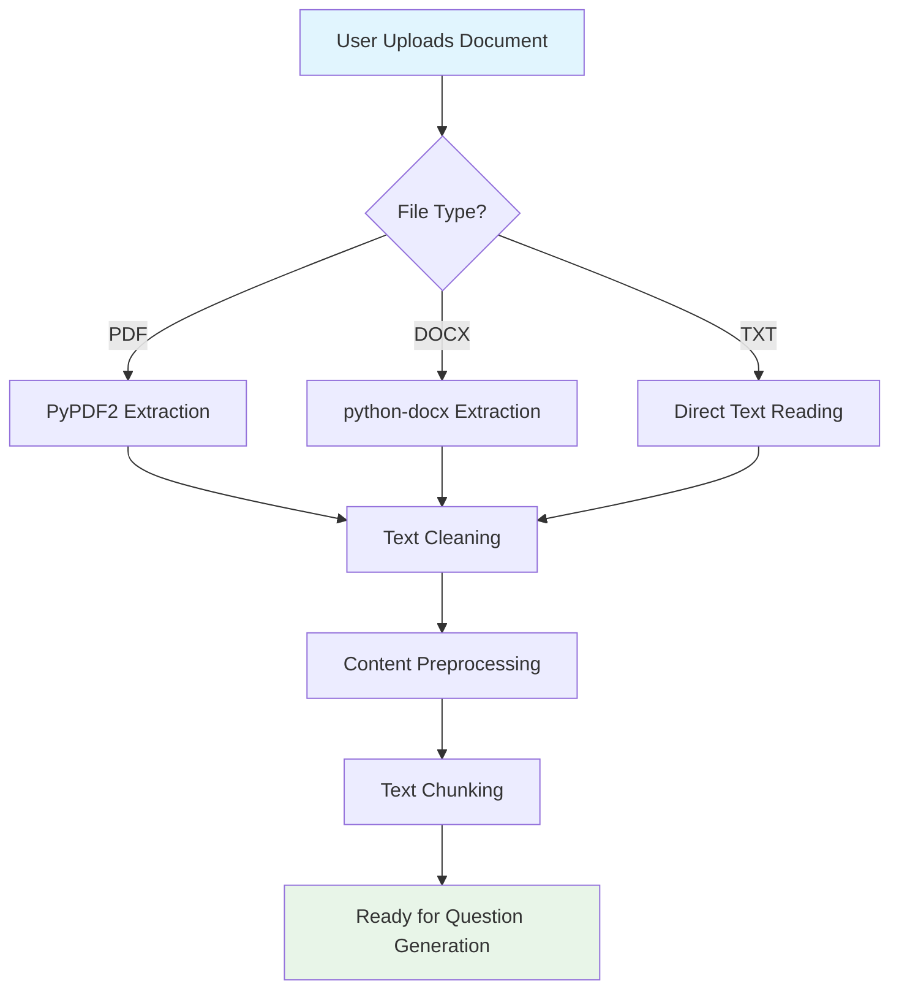
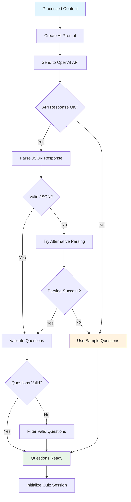
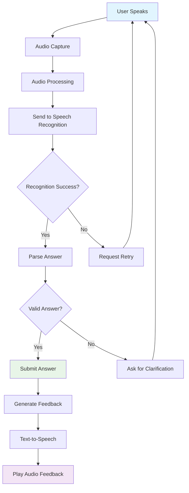
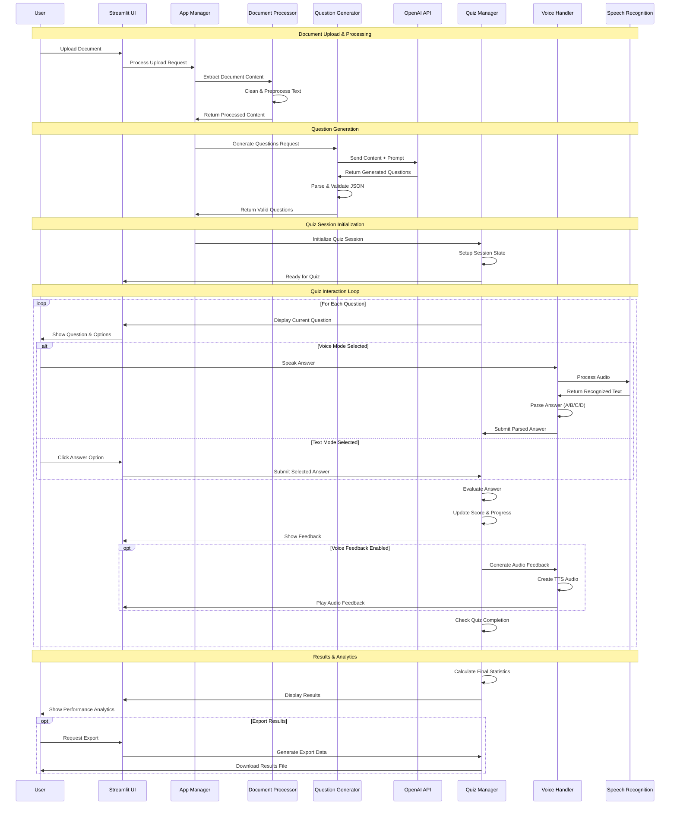
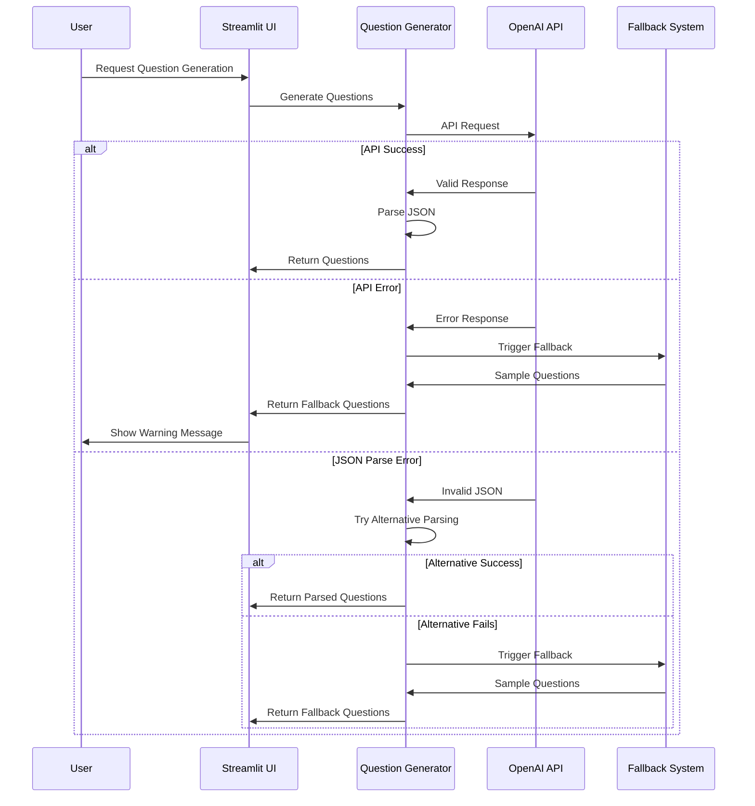
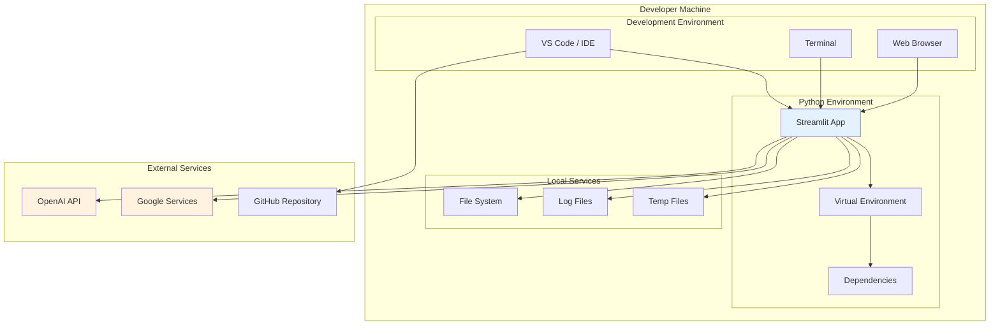
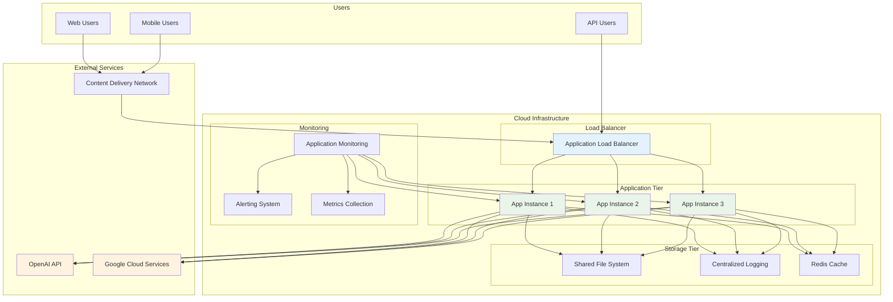
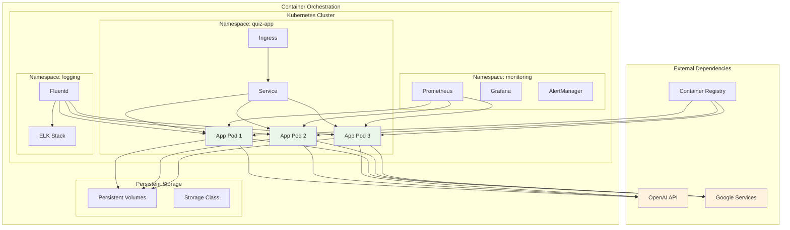

# 🏗️ Voice-Based Quiz Generator - Architecture Diagrams

## 📋 Table of Contents
1. [System Architecture Overview](#system-architecture-overview)
2. [Component Interaction Diagram](#component-interaction-diagram)
3. [Data Flow Diagrams](#data-flow-diagrams)
4. [Sequence Diagrams](#sequence-diagrams)
5. [Deployment Architecture](#deployment-architecture)

## 🏛️ System Architecture Overview

## 🔄 Component Interaction Diagram

## 📊 Data Flow Diagrams

### 1. Document Processing Flow

### 2. Question Generation Flow

### 3. Voice Processing Flow

## 🔄 Sequence Diagrams

### 1. Complete Quiz Session Sequence

### 2. Error Handling Sequence

## 🚀 Deployment Architecture

### 1. Local Development Architecture

### 2. Production Deployment Architecture

### 3. Container Deployment Architecture

---

## 📝 Diagram Legend

### Color Coding
- 🔵 **Blue**: User Interface Components
- 🟢 **Green**: Application Logic Components
- 🟠 **Orange**: External Services/APIs
- 🟣 **Purple**: Data Storage Components
- 🟡 **Yellow**: Infrastructure Components

### Component Types
- **Rectangles**: Services/Components
- **Diamonds**: Decision Points
- **Circles**: Start/End Points
- **Arrows**: Data Flow Direction
- **Dotted Lines**: Optional/Conditional Flow

This comprehensive architecture documentation provides a clear understanding of how the Voice-Based Quiz Generator system is structured, how components interact, and how data flows through the system.
